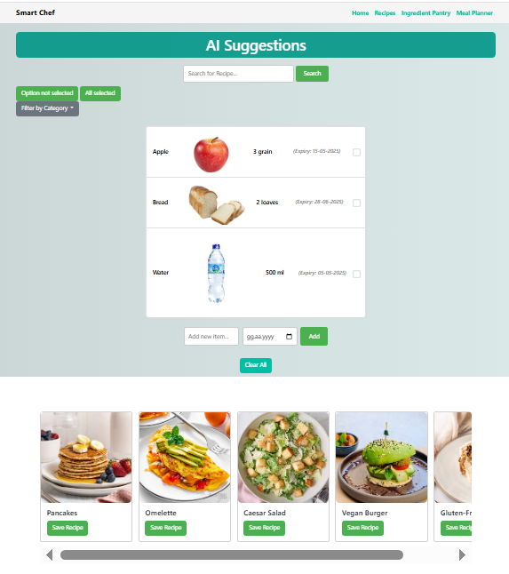
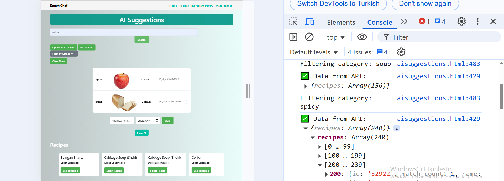

# 🤝 SMARTCHEF: AI-Powered Cooking Assistant!

**SmartChef**, yapay zeka destekli tarif önerileri, akıllı envanter yönetimi ve kullanıcı dostu yemek planlama özellikleri sunan modern bir yemek asistanıdır.  
Proje; **HTML/CSS/JS** tabanlı bir frontend, **Flask (Python)** tabanlı bir backend mimarisi ve ileride entegre edilecek **MSSQL veritabanı** ile geliştirilmektedir.

## 👨‍💻 Bu projede neler yaptım?

SmartChef projesine şu alanlarda katkı sağladım:

- 🧠 AI destekli tarif öneri sistemi geliştirdim (malzeme eşleştirme, eksik malzeme tespiti vb.)  
- 🔗 Frontend ile backend arasındaki veri akışını planladım ve uçtan uca entegrasyonu sağladım  
- 📦 Kullanıcının malzeme listesine göre tarif filtreleme ve öneri mantığını geliştirdim  
- 🎨 Kullanıcı arayüzünde kategori tabanlı filtreleme ve bileşen yapısını tasarladım  
- 🧭 Envanter yönetimi, tarif filtreleme ve öneri ekranlarını içeren frontend sayfalarının mantığını kurdum  

SmartChef şu anda aktif geliştiriliyor. Proje, yeni özelliklerle büyümeye açık bir yapıya sahip!





---

**SmartChef** is a modern AI-powered meal planner that helps users with intelligent recipe suggestions, smart inventory tracking, and an intuitive cooking assistant interface.  
The project uses a **HTML/CSS/JS frontend**, a **Flask (Python) backend**, and will be integrated with a **MSSQL database** in later stages.

## 👩‍💻 What I’ve done in this project:

Here are the areas I contributed to SmartChef:

- 🧠 Built the AI-powered recipe suggestion system (ingredient matching, missing items logic, etc.)  
- 🔗 Planned and implemented full communication between frontend and backend  
- 📦 Developed the filtering logic to suggest recipes based on available ingredients  
- 🎨 Designed category-based filters and UI component structure  
- 🧭 Structured the flow and logic for inventory, suggestion, and planning screens  

SmartChef is under active development and continues to evolve with new features and improvements!

---

## 🚀 Başlarken / Getting Started

1. Fork the repository and clone it:  
   ```bash
   git clone https://github.com/yourusername/smartchef.git
